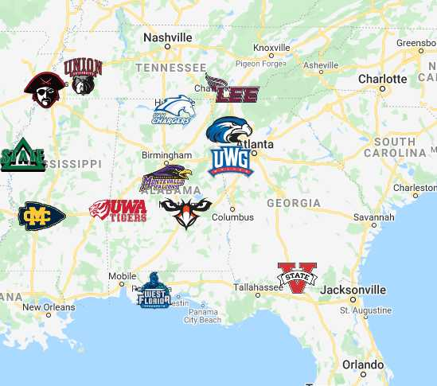

```{r, echo=FALSE, fig.align="center"}
library(knitr)

```


## In 2022, the softball team representing Auburn University at Montgomery were 
## regular season and tournament champions in the Gulf South Conference. They 
## went on to become NCAA regional champions and super-regional champions,  
## and went on to Denver to represent AUM(Auburn University at Montgomery)  
## at the NCAA D2 Softball World Series.
# ==========================================================================

## This project will analyze overall Gulf South Conference(GSC) hitter through a 
## method of sabermetrics to explore trends that led to how AUM became 2022 
## Conference Champions. This presentation will compare statistics to compare 
## the year's offensive performance between AUM and GSC listed from data  
## scraped directly from the Gulf South Conference's own website.Furthermore, 
## AUM and UAH(University of Alabama-Huntsville) will be directly compared,  
## since the teams faced off in th GSC tournament final and the NCAA Super 
## Regional final.
# ==================================================
## My hypothesis is that the hitting data will present trends that indicate how 
## AUM dominated their competition. It should be noted that defensive and 
## pitching data are not currently being analyzed in this project. Thus, if the 
## hypothesis is significantly contradicted this could be pointing to that the 
## defensive/pitching could explain AUM's success. Likely through analysis 
## beyond the current scope of this presentation, all three categories play key 
## roles in the 2022 season.

=

=

=

# Definitions provided by mlb.com

## Batting Average(AVG)-
batting average is determined by dividing a player's hits 
by his total at-bats for a number between zero (shown as .000) and one (1.000)

## On-base Plus Slugging(OPS)- 
adds on-base percentage and slugging percentage to 
get one number that unites the two. It's meant to combine how well a hitter can 
reach base, with how well he can hit for average and for power

## At Bat(AB)-
An official at-bat comes when a batter reaches base via a fielder's 
choice, hit or an error (not including catcher's interference) or when a batter 
is put out on a non-sacrifice. (Whereas a plate appearance refers to each 
completed turn batting, regardless of the result.)

## Run(R)-
A player is awarded a run if he crosses the plate to score his team a run

## Hit(H)- 
credited to a batter when the batter safely reaches or passes first base 
after hitting the ball into fair territory with neither the benefit of an error 
nor a fielder's choice

## Double(2B)-
A batter is credited with a double when he hits the ball into play 
and reaches second base without the help of an intervening error or attempt to 
put out another baserunner

## Triple(3B)-
a triple occurs when a batter hits the ball into play and reaches 
third base without the help of an intervening error or attempt to put out 
another baserunner

## Home Run(HR)-
A home run occurs when a batter hits a fair ball and scores on the 
play without being put out or without the benefit of an error

## Runs Batted In(RBI)-
A batter is credited with an RBI in most cases where the 
result of his plate appearance is a run being scored. There are a few 
exceptions, however. A player does not receive an RBI when the run scores as a 
result of an error or ground into double play.

## Total Bases(TB)-
Total bases refer to the number of bases gained by a batter 
through his hits. A batter records one total base for a single, two total bases 
for a double, three total bases for a triple and four total bases for a home run

## Slugging Perecentag(SLG%)-
Slugging percentage represents the total number of 
bases a player records per at-bat. Unlike on-base percentage, slugging 
percentage deals only with hits and does not include walks and hit-by-pitches in
its equation

## Walk(BB)- 
A walk (or base on balls) occurs when a pitcher throws four pitches 
out of the strike zone, none of which are swung at by the hitter. After 
refraining from swinging at four pitches out of the zone, the batter is awarded 
first base

## Hit By Pitch(HBP)- 
A hit-by-pitch occurs when a batter is struck by a pitched 
ball without swinging at it. He is awarded first base as a result. Strikes 
supersede hit-by-pitches, meaning if the umpire rules that the pitch was in the 
strike zone or that the batter swung, the HBP is nullified.

## Strikeout(SO)-
A strikeout occurs when a pitcher throws any combination of 
three swinging or looking strikes to a hitter. (A foul ball counts as a strike, 
but it cannot be the third and final strike of the at-bat. A foul tip, which is 
caught by the catcher, is considered a third strike.)

##Ground-rule Double Play(GDP)- 
occurs when a player hits a ground ball that 
results in multiple outs on the bases. The most common double plays are ground 
balls where a forceout is made on the player running from first to second base, 
then another forceout is made on the batter running to first base.

## On Base Percentage(OB%)- 
OB% refers to how frequently a batter reaches base per 
plate appearance. Times on base include hits, walks and hit-by-pitches, but do 
not include errors, times reached on a fielder's choice or a dropped third 
strike

## Sacrafice fly(SF)-
A sacrifice fly occurs when a batter hits a fly-ball out to 
the outfield or foul territory that allows a runner to score. The batter is 
given credit for an RBI.

## Sacrafice hit (SH)-
A sacrifice bunt occurs when a player is successful in his 
attempt to advance a runner (or multiple runners) at least one base with a bunt. 
In this vein, the batter is sacrificing himself (giving up an out) in order to 
move another runner closer to scoring.

```{r, echo=FALSE}

include_graphics("Gulf_South_Conference_logo.svg.PNG")
```

```{r echo=FALSE, message=FALSE, results=FALSE}
library(HistData)
library(tidyverse)
library(zeallot)
library(ggplot2)
library(gridExtra)
# Set the working directory to where the CSV file is located
setwd("C:/Users/weyen/OneDrive/Documents/Warhawk Softball/Warhawk-Softball")

# Import the CSV file using read.csv()
wh <- read.csv("2022 GSC SOFTBALL HITTING.csv")
#wh

summary(wh)
c(q1,md,mm,q3)%<-%summary(wh)[2:5]
mad_values <- apply(wh[,3:ncol(wh)],2, mad)
mad_values
iqr<-q3<-q1
iqr
apply(wh[, 3:ncol(wh)], 2, fivenum)

AUM<-wh %>% filter(School == "Auburn Montgomery")
UAH<-wh %>% filter(School == "Alabama Huntsville")
GSC<-wh %>% filter(School != "Auburn Montgomery")
GSC
UAH
AUM
```


# Leauge-wise Batting Average Visualisation
```{r, echo=FALSE,  fig.height=8, fig.asp = 1.15}

bp_AVG_AUM<-AUM %>% 
  ggplot(aes(AVG)) +
  geom_boxplot(color="orange", fill="black", size=.2, outlier.shape = 7)+ggtitle("AUM Boxplot")

bp_AVG_UAH<-UAH %>% 
  ggplot(aes(AVG)) +
  geom_boxplot(color="blue", fill="black", size=.2, outlier.shape = 7)+ggtitle("UAH Boxplot")

bp_AVG_GSC<-GSC %>% 
  ggplot(aes(AVG)) +
  geom_boxplot(color="red", fill="yellow", size=.2, outlier.shape = 7)+ggtitle("GSC Boxplot")

qq_AVG_AUM<-ggplot(AUM, aes(sample = AVG)) +
  geom_qq()+ggtitle("AUM qq Plot")

qq_AVG_UAH<-ggplot(UAH, aes(sample = AVG)) +
  geom_qq()+ggtitle("UAH qq Plot")

qq_AVG_GSC<-ggplot(GSC, aes(sample = AVG)) +
  geom_qq()+ggtitle("GSC qq Plot")

d_AVG_AUM<-AUM %>% ggplot(aes(AVG)) +
  geom_density(fill="orange", adjust=.1)+ggtitle("AUM Density Plot")

d_AVG_UAH<-UAH %>% ggplot(aes(AVG)) +
  geom_density(fill="blue", adjust=.1)+ggtitle("UAH Density Plot")

d_AVG_GSC<-GSC %>% ggplot(aes(AVG)) +
  geom_density(color='yellow',fill="red", adjust=.1)+ggtitle("GSC Density Plot")

h_AVG_AUM<-AUM %>% 
  ggplot(aes(AVG)) + 
  geom_histogram(color='black', fill='orange',bins=10)+ggtitle("AUM Histogram")

h_AVG_UAH<-UAH %>% 
  ggplot(aes(AVG)) + 
  geom_histogram(color='black', fill='blue',bins=10)+ggtitle("UAH Histogram")

h_AVG_GSC<-GSC %>% 
  ggplot(aes(AVG)) + 
  geom_histogram(color='yellow', fill='red',bins=10)+ggtitle("GSC Histogram")

b_AVG_AUM<-AUM %>% ggplot(aes(AVG)) + geom_bar(color= 'orange', fill='black')+ggtitle("AUM Barplot")

b_AVG_UAH<-UAH %>% ggplot(aes(AVG)) + geom_bar(color= 'blue', fill='black')+ggtitle("AUM Barplot")

b_AVG_GSC<-GSC %>% ggplot(aes(AVG)) + geom_bar(color= 'red', fill='yellow')+ggtitle("GSC Barplot")

grid.arrange(bp_AVG_AUM,bp_AVG_UAH,bp_AVG_GSC,qq_AVG_AUM,qq_AVG_UAH,qq_AVG_GSC,
             d_AVG_AUM,d_AVG_UAH,d_AVG_GSC,h_AVG_AUM,h_AVG_UAH,h_AVG_GSC,
             b_AVG_AUM,b_AVG_UAH,b_AVG_GSC, ncol = 3 )
``` 


# Leauge-wise OPS Visualisation
```{r, echo=FALSE,  fig.height=8, fig.asp = 1.15}

bp_OPS_AUM<-AUM %>% 
  ggplot(aes(OPS)) +
  geom_boxplot(color="orange", fill="black", size=.2, outlier.shape = 7)+ggtitle("AUM Boxplot")

bp_OPS_UAH<-UAH %>% 
  ggplot(aes(OPS)) +
  geom_boxplot(color="blue", fill="black", size=.2, outlier.shape = 7)+ggtitle("UAH Boxplot")

bp_OPS_GSC<-GSC %>% 
  ggplot(aes(OPS)) +
  geom_boxplot(color="red", fill="yellow", size=.2, outlier.shape = 7)+ggtitle("GSC Boxplot")

qq_OPS_AUM<-ggplot(AUM, aes(sample = OPS)) +
  geom_qq()+ggtitle("AUM qq Plot")

qq_OPS_UAH<-ggplot(UAH, aes(sample = OPS)) +
  geom_qq()+ggtitle("UAH qq Plot")

qq_OPS_GSC<-ggplot(GSC, aes(sample = OPS)) +
  geom_qq()+ggtitle("GSC qq Plot")

d_OPS_AUM<-AUM %>% ggplot(aes(OPS)) +
  geom_density(fill="orange", adjust=.1)+ggtitle("AUM Density Plot")

d_OPS_UAH<-UAH %>% ggplot(aes(OPS)) +
  geom_density(fill="blue", adjust=.1)+ggtitle("UAH Density Plot")

d_OPS_GSC<-GSC %>% ggplot(aes(OPS)) +
  geom_density(color='yellow',fill="red", adjust=.1)+ggtitle("GSC Density Plot")

h_OPS_AUM<-AUM %>% 
  ggplot(aes(OPS)) + 
  geom_histogram(color='black', fill='orange',bins=10)+ggtitle("AUM Histogram")

h_OPS_UAH<-UAH %>% 
  ggplot(aes(OPS)) + 
  geom_histogram(color='black', fill='blue',bins=10)+ggtitle("UAH Histogram")

h_OPS_GSC<-GSC %>% 
  ggplot(aes(OPS)) + 
  geom_histogram(color='yellow', fill='red',bins=10)+ggtitle("GSC Histogram")

b_OPS_AUM<-AUM %>% ggplot(aes(OPS)) + geom_bar(color= 'orange', fill='black')+ggtitle("AUM Barplot")

b_OPS_UAH<-UAH %>% ggplot(aes(OPS)) + geom_bar(color= 'blue', fill='black')+ggtitle("AUM Barplot")

b_OPS_GSC<-GSC %>% ggplot(aes(OPS)) + geom_bar(color= 'red', fill='yellow')+ggtitle("GSC Barplot")

grid.arrange(bp_OPS_AUM,bp_OPS_UAH,bp_OPS_GSC,qq_OPS_AUM,qq_OPS_UAH,qq_OPS_GSC,
             d_OPS_AUM,d_OPS_UAH,d_OPS_GSC,h_OPS_AUM,h_OPS_UAH,h_OPS_GSC,
             b_OPS_AUM,b_OPS_UAH,b_OPS_GSC, ncol = 3 )
``` 


